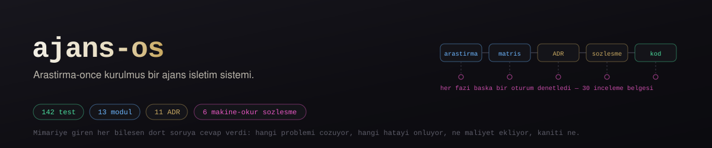
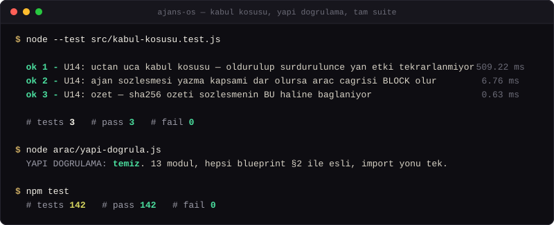

<p align="center">
  
  
  
  
  
  
</p>

# ajans-os

**Bir AI Agency Operating System.** Sıradan bir "ajan koleksiyonu" değil:
kullanıcı hedefini alan, parçalara ayıran, doğru uzman ajanları seçen,
paralel/sıralı çalıştıran, sonucu eleştirmen ajanlarla denetleyen,
hatayı yakalayıp toparlayan, her adımı izleyen ve kendi geçmişinden
öğrenen bir çekirdek.

> Durum: **Faz 5 — Uygulama.** Çekirdek çalışıyor: `src/` altında 13 modül,
> ~2.848 satır kaynak (test dosyaları hariç), 145 geçen test ve uçtan uca
> bir kabul koşusu. Araştırma → karşılaştırma → sentez → tasarım → uygulama
> sırası korundu; kod en sona yazıldı.

## Çalıştır

Bağımlılık yok; Node 22+ yeterli.

```bash
git clone https://github.com/Furkiozknn/ajans-os && cd ajans-os
npm test        # 145 test (uçtan uca kabul koşusu dahil)
npm run yapi    # yapı doğrulama: 13 modül, blueprint §2 ile eşli, import yönü tek
npm run sema    # sözleşmeler: örnekler + doğrulayıcının öz-testi + mutasyon ölçümü
npm run kapi    # hepsi birden — kapı kontrolü (CI'ın koştuğu komutun aynısı)
```

**İlk koşuda göreceğiniz iki atlama bilinçli, hata değil:**

- `npm test` → `# pass 144`, `# skipped 1`. Atlanan U15'tir: türetilen ajan
  dosyasını komşu projenin doğrulayıcısından ([turkce-ajanlar](https://github.com/Furkiozknn/turkce-ajanlar)
  `arac/dogrula.js`) geçirir ve onu varsayılan olarak `../turkce-ajanlar`'da
  arar. Tam 145/145 için komşuyu yanına klonlayın ya da yolunu verin:
  `AJANS_OS_KOMSU=/yol/turkce-ajanlar npm test`. CI bunu pinli bir SHA ile
  yapar ve U15 atlanırsa kırmızıya düşer.
- `npm run kapi` sonunda `5 gecti, 0 kaldi, 1 atlandi`. Atlanan, araştırma
  kanıt doğrulayıcısının uçtan uca bölümüdür; incelenen projelerin yerel
  klonlarını ister (`AJANS_OS_KLONLAR=<klon-kök>`). Kapı yine 0 döner.

Arayüz tipleri (`src/**/*.d.ts`) CI'da ayrıca denetlenir; yerelde aynısı:
`npx -p typescript@5.9.3 tsc -p .` (TypeScript bağımlılık değil, yalnızca bu
denetim için indirilir).

### Nereden başlamalı

1. **[src/kabul-kosusu.test.js](src/kabul-kosusu.test.js)** — bileşim kökü:
   13 modül nasıl birbirine bağlanır, bir görev nasıl koşar, nasıl öldürülüp
   diskten sürdürülür. Kodu okumaya buradan başlayın.
2. **[docs/mimari/00-BLUEPRINT.md](docs/mimari/00-BLUEPRINT.md)** — bir adımın
   orkestratörde izlediği sıra (§3.2) ve bileşenlerin sınırları.
3. **[docs/adr/](docs/adr/)** — her kararın gerekçesi ve reddedilen seçenekler.
4. **[BILINEN-TUZAKLAR.md](BILINEN-TUZAKLAR.md)** — bu depoda gerçekten yaşanmış
   hatalar ve neden oldukları.

`npm run sema`'nın üçüncü adımı (`arac/sema-mutasyon.js`) alışılmadık ve
kasıtlı. Sözleşme doğrulayıcısının 106 kontrollük bir öz-testi var ve
"temiz" diyordu; bu, kontrollerin geçtiğini söyler, hangi kuralların
*korunduğunu* söylemez. Araç her zorlama noktası için doğrulayıcının bir
kopyasını üretip o tek satırı etkisizleştiriyor ve kopyanın kendi
`--test`inin bunu yakalamasını bekliyor. İlk ölçüm: 19 noktanın **8'i**
hayatta kaldı — `type` dahil. Yani doğrulayıcı o kurallar için sessizce
doğrulamayı bırakabilirdi ve ne öz-test ne örnekler ne de kapı fark
ederdi. `sema-dogrula.js --test` içine doğrulayıcının kendi mekaniğini
sınayan bir blok eklendi; ölçüm şimdi 19/19.

Kapı bunların hepsini koşar, ve CI aynı komutu koşar — ikisi birbirinden
kayamasın diye. `.github/workflows/ci.yml` ayrıca sözleşme kapısının ve
komşu doğrulayıcıyı kullanan U15 testinin çıktıda **gerçekten göründüğünü**
ayrı adımlarda arıyor: bu depo bir kez 142 testi hiç koşmadan yeşil kaldı
(o zaman `.github/workflows/` yoktu), bir kez de U15 kendini atlarken yeşil
kaldı. Bir kapının koştuğunu varsaymak, koştuğunu ölçmek değildir.

Deponun en güçlü kanıtı **kabul koşusudur**: 13 modülün gerçek uygulamaları
elle bağlanır, tek bir görev baştan sona koşar, koşunun ürettiği her belge
(görev kaydı, izin kararları, span'ler) deponun kendi şema doğrulayıcısından
geçirilir; sonra koşu ortasından öldürülüp görev **diskten** yeniden
yüklenerek sürdürülür ve yan etkinin tekrarlanmadığı ölçülür. Ağa çıkmaz,
gerçek LLM çağırmaz — sahte olan tek şey model taşıyıcısıdır.

<p align="center">
  
</p>

<p align="center"><sub><i>Gerçek bir koşu, üç komut: <code>node --test src/kabul-kosusu.test.js</code>, <code>npm run yapi</code>, <code>npm test</code>. Ağ bağlantınız kapalıyken de aynı çıktı — koşu ağa çıkmaz.</i></sub></p>

## Neden var

Açık kaynak agent ekosistemi çok parçalı: biri orkestrasyonda iyi,
biri bellekte, biri sandboxing'de, biri gözlemlenebilirlikte. Hiçbiri
tek başına bir "işletim sistemi" değil ve çoğu tek bir LLM sağlayıcısına
ya da tek bir çerçeveye bağlı.

Bu proje o parçaları **kopyalamaz**: her alandaki en güçlü mimari fikri
kanıtıyla belirler, birbiriyle uyumlu olanları tek bir tasarımda
birleştirir, uyumsuz veya zararlı olanları gerekçesiyle dışarıda bırakır.

## Altı sütun

| Sütun | Kapsadığı yetenekler |
|---|---|
| **Anlama ve planlama** | hedef anlama, görev ayrıştırma, dinamik DAG, uzman ajan seçimi |
| **Yürütme** | paralel/sıralı orkestrasyon, kontrollü ajan-ajan iletişimi, araç kullanımı |
| **Güvenilirlik** | eleştirmen/değerlendirici ajanlar, hata tespiti, retry / fallback / checkpoint / rollback |
| **Bellek ve bağlam** | kısa/uzun süreli bellek, bağlam yönetimi, RAG, bilgi katmanı |
| **Güvenlik** | izin sistemi, izolasyon, hata sınırları, riskli işlemde insan onayı |
| **Gözlem ve öğrenme** | izleme, ölçme, maliyet/gecikme/model optimizasyonu, deneyimden öğrenme |

Her sütun, [ADR-000](docs/adr/ADR-000-program-ve-ilkeler.md)'daki
**dahil etme ölçütünü** geçmek zorunda: çözdüğü problem, önlediği hata,
eklediği maliyet ve kanıtı olmayan hiçbir bileşen mimariye girmez.

## Program

```
Faz 1  Araştırma        6 iz, her izde 6-10 proje, kanıtlı analiz
Faz 2  Karşılaştırma    matris, en iyi fikirler, anti-pattern'ler
Faz 3  Sentez           mimari blueprint + 7 alt mimari
Faz 4  Tasarım          klasör yapısı, çekirdek arayüzler, sözleşmeler
Faz 5  Uygulama         modül modül, her biri bağımsız test edilebilir
```

Araştırma nasıl yapılır: [docs/00-ARASTIRMA-PROTOKOLU.md](docs/00-ARASTIRMA-PROTOKOLU.md)
Kararlar ve gerekçeleri: [docs/adr/](docs/adr/)
Ajan sözleşmesi (makine-okur): [contracts/agent.schema.json](contracts/agent.schema.json)
Sıradaki işler: [YOL-HARITASI.md](YOL-HARITASI.md)

## Klasörler

| Klasör | Ne için |
|---|---|
| `docs/arastirma/<iz>/` | Proje başına analiz dosyaları + iz özeti |
| `docs/adr/` | Architecture Decision Record'lar — her kararın gerekçesi |
| `docs/mimari/` | Blueprint ve 8 alt mimari (ajan, orkestrasyon, bellek, değerlendirme, güvenlik, gözlem, kendini geliştirme, yapı) |
| `contracts/` | 6 JSON Schema sözleşmesi — ajan, görev, mesaj, izin, span, öneri — ve `ornek/` altında geçerli örnekleri |
| `src/` | Çekirdek: 13 modül, her biri `index.js` + `index.d.ts` + `index.test.js`; ayrıca `kabul-kosusu.test.js` (uçtan uca) |
| `arac/` | Kapı araçları: yapı doğrulama, bağımlılıksız şema doğrulayıcı + mutasyon ölçümü, araştırma kanıt doğrulayıcı |
| `veri/` | Model fiyat tablosu — maliyet yöneticisi fiyatı koddan değil buradan okur |

## Sınırlar

- Bir **referans çekirdek**, yayımlanmış bir paket ya da CLI değil
  (`package.json` `private: true`). Kullanım yolu: modülleri kendi bileşim
  kökünüzde bağlamak — kabul koşusu bunun çalışan örneği.
- Depoda gerçek bir LLM sağlayıcı taşıyıcısı yok; `ModelTasiyici` arayüzü var,
  testler sahtesini kullanır. Ağa çıkan kod yok.
- Kalıcılık yerel dosya sistemi (görev kaydı JSON, iz JSONL); tek süreç
  varsayılır, eş zamanlı yazıcılar için kilit yok.

## Dil

Belgeler Türkçe. Kod tanımlayıcıları ve sözleşme alan adları İngilizce —
sağlayıcı SDK'ları, protokoller (MCP, A2A) ve ekosistem İngilizce; ara
katmanda çeviri yapmak hata kaynağı. Gerekçe ADR-000'da.

## Lisans

MIT.

---

## Bu ekosistemden başka projeler

- **[mcp-census](https://github.com/Furkiozknn/mcp-census)** — resmî MCP Registry'nin yeniden üretilebilir sayımı
- **[mcp-vet](https://github.com/Furkiozknn/mcp-vet)** — bir MCP sunucusunun kaynağını kurmadan önce denetler

<sub>Hepsi tek bir aranabilir sayfada: **[furkiozknn.github.io](https://furkiozknn.github.io/)** — her kart, o deponun kendi <code>project-meta.json</code> dosyasından üretiliyor.</sub>
