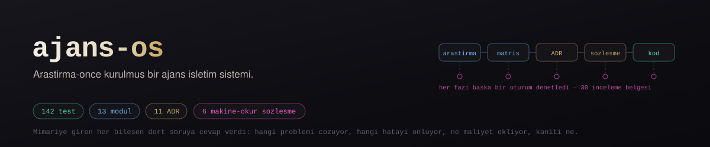
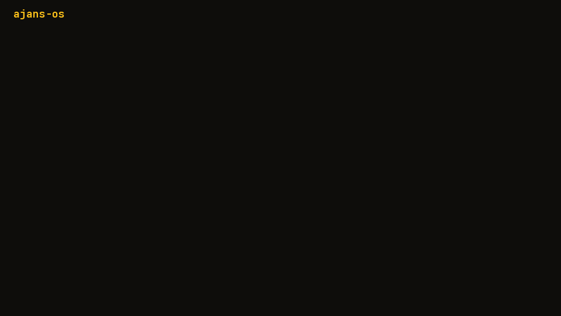

# ajans-os

**A research-first agency operating system core: its acceptance run is killed mid-task, reloaded from disk and resumed, then checked that no side effect ran twice.**
Araştırma-önce kurulmuş bir ajan işletim sistemi çekirdeği: kabul koşusu görevin ortasında öldürülür, diskten sürdürülür ve hiçbir yan etkinin ikinci kez çalışmadığı ölçülür.

```sh
git clone https://github.com/Furkiozknn/ajans-os && cd ajans-os && npm run kapi
```

Node 22+ yeter; kurulacak bir şey yok (bağımlılık: 0). Temiz klondan kapının bitişine **16–24 s** ölçüldü (Windows 11, Node 24; dört taze koşuda klon ~2 s + `npm run kapi` 14–22 s). Kapı yeşilse çıkış kodu 0'dır. Ekranın sonunda "1 atlandı" görürsünüz; hata değil, [aşağıda](#ilk-koşuda-göreceğiniz-iki-atlama-bilinçli-hata-değil) açıklandı.

> Windows PowerShell 5.1'de `&&` yoktur (ayrıştırma hatası verir); komutları `;` ile ayırın:
> `git clone https://github.com/Furkiozknn/ajans-os; cd ajans-os; npm run kapi` (PowerShell 5.1'de denendi: çıkış 0, 18 s).
> Bu README'deki `AJANS_OS_...=değer komut` biçimi bash/zsh içindir; PowerShell'de `$env:AJANS_OS_KOMSU='yol'; npm test`.

<p align="center"></p>
<p align="center"><sub>Gerçek çıktı: <a href="docs/demo/kaydet.js">kaydet.js</a> komutları koşar (kayıt: <a href="docs/demo/komutlar.txt">komutlar.txt</a>), <a href="docs/demo/uret.py">uret.py</a> çizer; ekrandaki hiçbir satır elle yazılmadı. <code>npm run kapi</code> bu parçaların hepsini ve testlerin tamamını koşar; son sahne onun yalnız son 6 satırıdır.</sub></p>

| Ne zaman kullanılır | Ne zaman kullanılmaz |
|---|---|
| Bir ajan sistemi tasarlıyor ve **kanıtlı** bir referans arıyorsanız: 40 projenin kaynak okumasından (dosya:satır) çıkan 11 ADR, gerekçeleri ve reddedilen seçenekleriyle | Kurup çalıştıracağınız bir paket ya da CLI arıyorsanız: yayımlanmış paket yok (`private: true`), `bin` yok |
| Ajan, görev, mesaj, izin, span ve öneri sözleşmelerini makine-okur JSON Schema olarak almak istiyorsanız, bağımlılıksız bir doğrulayıcıyla | Hazır bir LLM sağlayıcı entegrasyonu bekliyorsanız: yalnızca `ModelTasiyici` arayüzü var, ağa çıkan kod yok |
| Modülleri kendi bileşim kökünüzde bağlayacaksanız: [`src/kabul-kosusu.test.js`](src/kabul-kosusu.test.js) çalışan örnektir | Çok süreçli ya da eşzamanlı yazıcılar gerekiyorsa: kalıcılık yerel dosya, tek süreç, kilit yok |
| Bir doğrulayıcının **gerçekten neyi koruduğunu** mutasyonla ölçme fikrini görmek istiyorsanız | Bir "ajan prompt koleksiyonu" arıyorsanız: burada ajan bir sözleşmedir, prompt listesi değil |

<p align="center">
  <a href="https://github.com/Furkiozknn/ajans-os/actions/workflows/ci.yml"></a>
  
  
  
  
  
  
</p>

**Bir AI Agency Operating System.** Sıradan bir "ajan koleksiyonu" değil:
kullanıcı hedefini alan, parçalara ayıran, doğru uzman ajanları seçen,
paralel/sıralı çalıştıran, sonucu eleştirmen ajanlarla denetleyen,
hatayı yakalayıp toparlayan, her adımı izleyen ve kendi geçmişinden
öğrenen bir çekirdek.

> Durum: **Faz 5 — Uygulama.** Çekirdek çalışıyor: `src/` altında 13 modül,
> ~2.848 satır kaynak (test dosyaları hariç), 179 test ve uçtan uca
> bir kabul koşusu; `contracts/` altında 6 şema, `docs/adr/` altında 11 ADR.
> Araştırma → karşılaştırma → sentez → tasarım → uygulama
> sırası korundu; kod en sona yazıldı.

## Çalıştır

Bağımlılık yok; Node 22+ yeterli. Yukarıdaki tek komut hepsini koşar; parça parça:

```bash
git clone https://github.com/Furkiozknn/ajans-os && cd ajans-os
npm test        # 179 test (uçtan uca kabul koşusu dahil)
npm run yapi    # yapı doğrulama: 13 modül, blueprint §2 ile eşli, import yönü tek
npm run sema    # sözleşmeler: örnekler + doğrulayıcının öz-testi + mutasyon ölçümü
npm run kapi    # hepsi birden — kapı kontrolü (CI'ın koştuğu komutun aynısı)
```

Her `arac/*.js` betiği `--help` bilir (ör. `node arac/sema-dogrula.js --help`). Yanlış
yazılmış bir bayrak sessizce geçmez: en yakın bayrağı önerip 2 ile çıkar. Çıkış kodları:
0 temiz, 1 doğrulama hatası, 2 kullanım hatası ya da girdi okunamadı.

### İlk koşuda göreceğiniz iki atlama bilinçli, hata değil

- `npm test` → `pass 178`, `skipped 1` (toplam 179). Atlanan U15'tir: türetilen ajan
  dosyasını komşu projenin doğrulayıcısından ([turkce-ajanlar](https://github.com/Furkiozknn/turkce-ajanlar)
  `arac/dogrula.js`) geçirir ve onu varsayılan olarak `../turkce-ajanlar`'da
  arar. Tam 179/179 için komşuyu yanına klonlayın ya da yolunu verin:
  `AJANS_OS_KOMSU=/yol/turkce-ajanlar npm test`. CI bunu pinli bir SHA ile
  yapar ve U15 atlanırsa kırmızıya düşer. (Satırın öneki koşucunun sürümüne
  göre `ℹ` ya da `# ` olur: Node 24'te `ℹ pass 178`, Node 22'nin TAP çıktısında
  `# pass 178`. Sayılar aynıdır.)
- `npm run kapi` sonunda `5 gecti, 0 kaldi, 1 atlandi`. Atlanan, araştırma
  kanıt doğrulayıcısının uçtan uca bölümüdür; incelenen projelerin yerel
  klonlarını ister (`AJANS_OS_KLONLAR=<klon-kök>`). Kapı yine 0 döner.

Arayüz tipleri (`src/**/*.d.ts`) CI'da ayrıca denetlenir; yerelde aynısı:
`npx -p typescript@5.9.3 tsc -p .` (TypeScript bağımlılık değil, yalnızca bu
denetim için indirilir).

### Nereden başlamalı

1. **[src/kabul-kosusu.test.js](src/kabul-kosusu.test.js)** — bileşim kökü:
   13 modül nasıl birbirine bağlanır, bir görev nasıl koşar, nasıl öldürülüp
   diskten sürdürülür. Kodu okumaya buradan başlayın.
2. **[docs/mimari/00-BLUEPRINT.md](docs/mimari/00-BLUEPRINT.md)** — bir adımın
   orkestratörde izlediği sıra (§3.2) ve bileşenlerin sınırları.
3. **[docs/adr/](docs/adr/)** — her kararın gerekçesi ve reddedilen seçenekleri.
4. **[BILINEN-TUZAKLAR.md](BILINEN-TUZAKLAR.md)** — bu depoda gerçekten yaşanmış
   hatalar ve neden oldukları.

`npm run sema`'nın üçüncü adımı (`arac/sema-mutasyon.js`) alışılmadık ve
kasıtlı. Sözleşme doğrulayıcısının öz-testi (bugün 127 kontrol; mutasyon aracı
eklendiğinde 106'ydı) "temiz" diyordu; bu, kontrollerin geçtiğini söyler, hangi
kuralların *korunduğunu* söylemez. Araç her zorlama noktası için doğrulayıcının
bir kopyasını üretip o tek satırı etkisizleştiriyor ve kopyanın kendi
`--test`inin bunu yakalamasını bekliyor. İlk ölçüm: 19 noktanın **8'i**
hayatta kaldı — `type` dahil. Yani doğrulayıcı o kurallar için sessizce
doğrulamayı bırakabilirdi ve ne öz-test ne örnekler ne de kapı fark
ederdi. `sema-dogrula.js --test` içine doğrulayıcının kendi mekaniğini
sınayan bir blok eklendi; ölçüm şimdi 19/19.

Kapı bunların hepsini koşar, ve CI aynı komutu koşar — ikisi birbirinden
kayamasın diye. `.github/workflows/ci.yml` ayrıca sözleşme kapısının ve
komşu doğrulayıcıyı kullanan U15 testinin çıktıda **gerçekten göründüğünü**
ayrı adımlarda arıyor: bu depo bir kez 142 testi hiç koşmadan yeşil kaldı
(o zaman `.github/workflows/` yoktu), bir kez de U15 kendini atlarken yeşil
kaldı. Bir kapının koştuğunu varsaymak, koştuğunu ölçmek değildir. Aynı
mantıkla README'deki test sayısı da CI'da koşunun yazdığı sayıyla, modül /
ADR / şema / satır sayıları da bir testle diskle karşılaştırılır.

Deponun en güçlü kanıtı **kabul koşusudur**: 13 modülün gerçek uygulamaları
elle bağlanır, tek bir görev baştan sona koşar, koşunun ürettiği her belge
(görev kaydı, izin kararları, span'ler) deponun kendi şema doğrulayıcısından
geçirilir; sonra koşu ortasından öldürülüp görev **diskten** yeniden
yüklenerek sürdürülür ve yan etkinin tekrarlanmadığı ölçülür. Ağa çıkmaz,
gerçek LLM çağırmaz — sahte olan tek şey model taşıyıcısıdır.

## Neden var

Açık kaynak agent ekosistemi çok parçalı: biri orkestrasyonda iyi,
biri bellekte, biri sandboxing'de, biri gözlemlenebilirlikte. Hiçbiri
tek başına bir "işletim sistemi" değil ve çoğu tek bir LLM sağlayıcısına
ya da tek bir çerçeveye bağlı.

Bu proje o parçaları **kopyalamaz**: her alandaki en güçlü mimari fikri
kanıtıyla belirler, birbiriyle uyumlu olanları tek bir tasarımda
birleştirir, uyumsuz veya zararlı olanları gerekçesiyle dışarıda bırakır.

## Altı sütun

| Sütun | Kapsadığı yetenekler |
|---|---|
| **Anlama ve planlama** | hedef anlama, görev ayrıştırma, dinamik DAG, uzman ajan seçimi |
| **Yürütme** | paralel/sıralı orkestrasyon, kontrollü ajan-ajan iletişimi, araç kullanımı |
| **Güvenilirlik** | eleştirmen/değerlendirici ajanlar, hata tespiti, retry / fallback / checkpoint / rollback |
| **Bellek ve bağlam** | kısa/uzun süreli bellek, bağlam yönetimi, RAG, bilgi katmanı |
| **Güvenlik** | izin sistemi, izolasyon, hata sınırları, riskli işlemde insan onayı |
| **Gözlem ve öğrenme** | izleme, ölçme, maliyet/gecikme/model optimizasyonu, deneyimden öğrenme |

Her sütun, [ADR-000](docs/adr/ADR-000-program-ve-ilkeler.md)'daki
**dahil etme ölçütünü** geçmek zorunda: çözdüğü problem, önlediği hata,
eklediği maliyet ve kanıtı olmayan hiçbir bileşen mimariye girmez.

## Program

```
Faz 1  Araştırma        6 iz, her izde 6-10 proje, kanıtlı analiz
Faz 2  Karşılaştırma    matris, en iyi fikirler, anti-pattern'ler
Faz 3  Sentez           mimari blueprint + 7 alt mimari
Faz 4  Tasarım          klasör yapısı, çekirdek arayüzler, sözleşmeler
Faz 5  Uygulama         modül modül, her biri bağımsız test edilebilir
```

Araştırma nasıl yapılır: [docs/00-ARASTIRMA-PROTOKOLU.md](docs/00-ARASTIRMA-PROTOKOLU.md)
Kararlar ve gerekçeleri: [docs/adr/](docs/adr/)
Ajan sözleşmesi (makine-okur): [contracts/agent.schema.json](contracts/agent.schema.json)
Sıradaki işler: [YOL-HARITASI.md](YOL-HARITASI.md)
Bu yenilemenin denetimi ve tasarımı: [docs/DENETIM.md](docs/DENETIM.md), [docs/TASARIM.md](docs/TASARIM.md)

## Klasörler

| Klasör | Ne için |
|---|---|
| `docs/arastirma/<iz>/` | Proje başına analiz dosyaları + iz özeti |
| `docs/adr/` | Architecture Decision Record'lar — her kararın gerekçesi |
| `docs/mimari/` | Blueprint ve 8 alt mimari (ajan, orkestrasyon, bellek, değerlendirme, güvenlik, gözlem, kendini geliştirme, yapı) |
| `docs/demo/` | README demosunun kaydı ve çizicisi (`kaydet.js`, `uret.py`, `komutlar.txt`) |
| `contracts/` | 6 JSON Schema sözleşmesi — ajan, görev, mesaj, izin, span, öneri — ve `ornek/` altında geçerli örnekleri |
| `src/` | Çekirdek: 13 modül, her biri `index.js` + `index.d.ts` + `index.test.js`; ayrıca `kabul-kosusu.test.js` (uçtan uca), `arac-cli.test.js` ve `belge-sayilari.test.js` |
| `arac/` | Kapı araçları: yapı doğrulama, bağımlılıksız şema doğrulayıcı + mutasyon ölçümü, araştırma kanıt doğrulayıcı, iz izleyici, matris üretici; hepsi `--help` bilir |
| `veri/` | Model fiyat tablosu — maliyet yöneticisi fiyatı koddan değil buradan okur |

## Sınırlar

- Bir **referans çekirdek**, yayımlanmış bir paket ya da CLI değil
  (`package.json` `private: true`). Kullanım yolu: modülleri kendi bileşim
  kökünüzde bağlamak — kabul koşusu bunun çalışan örneği.
- Depoda gerçek bir LLM sağlayıcı taşıyıcısı yok; `ModelTasiyici` arayüzü var,
  testler sahtesini kullanır. Ağa çıkan kod yok.
- Kalıcılık yerel dosya sistemi (görev kaydı JSON, iz JSONL); tek süreç
  varsayılır, eş zamanlı yazıcılar için kilit yok.

## Dil

Belgeler Türkçe. Kod tanımlayıcıları ve sözleşme alan adları İngilizce —
sağlayıcı SDK'ları, protokoller (MCP, A2A) ve ekosistem İngilizce; ara
katmanda çeviri yapmak hata kaynağı. Gerekçe ADR-000'da.

## Lisans

MIT.

---

## Bu ekosistemden başka projeler

- **[mcp-census](https://github.com/Furkiozknn/mcp-census)** — resmî MCP Registry'nin yeniden üretilebilir sayımı
- **[mcp-vet](https://github.com/Furkiozknn/mcp-vet)** — bir MCP sunucusunun kaynağını kurmadan önce denetler

<sub>Hepsi tek bir aranabilir sayfada: **[furkiozknn.github.io](https://furkiozknn.github.io/)** — her kart, o deponun kendi <code>project-meta.json</code> dosyasından üretiliyor.</sub>
